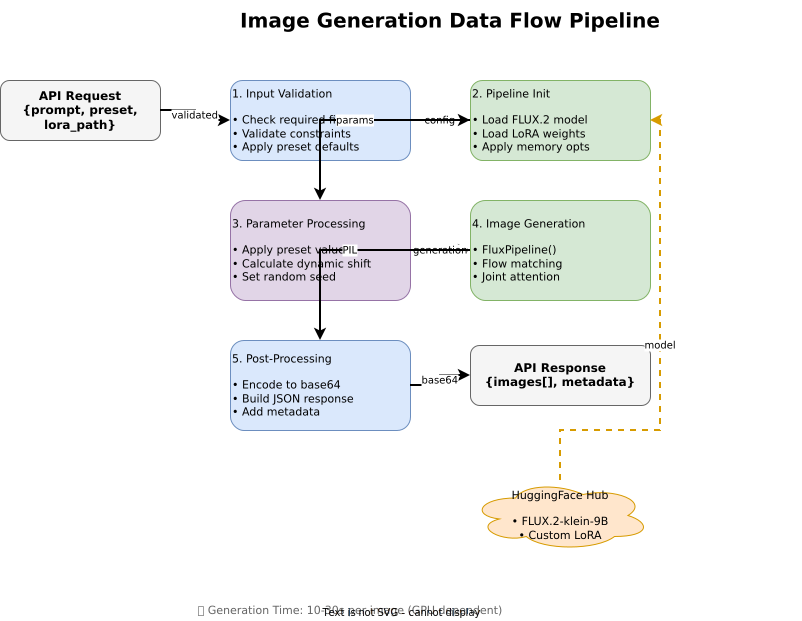

# FLUX.2-klein-base-9B RunPod Serverless

[](https://runpod.io)
[](https://python.org)
[](https://pytorch.org)
[](LICENSE)

> A production-ready RunPod serverless deployment for FLUX.2-klein image generation with custom LoRA weight support.

This serverless API generates high-quality images using the **FLUX.2-klein** diffusion model with support for custom LoRA weights. It features optimized presets for ultra-realistic human character generation, flow matching inference, S3 storage with presigned URLs, and dynamic shift calculation that matches ai-toolkit training behavior.

## ✨ Features

- **FLUX.2-klein** - State-of-the-art diffusion model by Black Forest Labs
- **Custom LoRA Support** - Load LoRA weights from HuggingFace, local files, or direct HTTPS URLs
- **Flash Attention 2** - Memory-efficient attention for faster inference
- **Dynamic Shift Calculation** - Matches training behavior for optimal results
- **Optimized Presets** - Research-backed settings for realistic characters, portraits, and more
- **Flexible Generation** - Configurable resolution, steps, guidance scale, and batch size
- **Multiple Output Formats** - PNG, JPEG, WebP support
- **S3 Storage** - Upload images to S3 with presigned URLs (no more base64 size limits!)
- **RunPod Model Cache** - Optimized HuggingFace cache on network volumes
- **High-Performance Downloads** - Xet storage backend with concurrent downloads

## 🏗️ Architecture



The system follows a modular architecture where RunPod Serverless receives API requests and routes them through the handler pipeline. The FluxPipeline manages model inference with VAE slicing/tiling optimizations while supporting dynamic LoRA weight loading from HuggingFace Hub, local storage, or direct HTTPS URLs.

### Data Flow Pipeline

1. **Input Validation** - Request parameters validated against schema, preset defaults applied
2. **Pipeline Init** - FLUX.2 model loaded with optional LoRA weights, memory optimizations enabled
3. **Parameter Processing** - Preset values applied, dynamic shift calculated based on resolution
4. **Image Generation** - Flow matching scheduler generates images via FluxPipeline
5. **Post-Processing** - Images uploaded to S3 (presigned URL) or encoded to base64, JSON response with metadata built

## 🚀 Quick Start

### Prerequisites

- **Docker** - For containerized deployment
- **RunPod Account** - For serverless GPU deployment (free tier available)
- **NVIDIA GPU** - At least 16GB VRAM for local testing (H100/A100 recommended for production)

### Installation

```bash
# Clone the repository
git clone https://github.com/YOUR_USERNAME/flux.2-klein-serverless.git
cd flux.2-klein-serverless

# Build the Docker image
docker build -t flux-2-klein-serverless .

# Run locally (GPU required)
# Note: Set HF_TOKEN if the model is gated on HuggingFace
docker run --gpus all -p 8000:8000 \
  -e HF_TOKEN=your_huggingface_token \
  flux-2-klein-serverless

# Test the endpoint
curl -X POST http://localhost:8000/runpod/v1/lgpu/input \
  -H "Content-Type: application/json" \
  -d @test_input.json
```

### Deploy to RunPod (GitHub Integration)

The easiest deployment method uses RunPod's GitHub integration for automatic builds on every push.

1. **Push code to GitHub:**
```bash
git init
git add .
git commit -m "Initial FLUX.2-klein serverless implementation"
git remote add origin https://github.com/YOUR_USERNAME/YOUR_REPO.git
git push -u origin main
```

2. **Create Serverless Template** at [console.runpod.io/serverless/user/templates](https://console.runpod.io/serverless/user/templates):
   - Select **GitHub** as source
   - Choose your repository
   - Configure: **Container Disk**: 30 GB, **Min/Max Workers**: 0-10, **GPU**: NVIDIA H100
   - **Network Volume**: Recommended for model caching (30GB+)

3. **Set Environment Variables** (see Configuration section below)

4. **Deploy** - RunPod automatically builds and deploys. Future pushes trigger redeployment.

## 📖 Documentation

### Optimized Presets

Research-backed presets from Black Forest Labs documentation, fal.ai guides, and community testing:

| Preset | Steps | Guidance | Resolution | Best For |
|--------|-------|----------|------------|----------|
| `realistic_character` | 28 | 2.5 | 1024×1024 | **Ultra-realistic human LoRAs** (default) |
| `portrait_hd` | 30 | 3.0 | 1024×1536 | High-detail vertical portraits |
| `cinematic_full` | 28 | 3.5 | 1536×1024 | Full-body cinematic compositions |
| `fast_preview` | 15 | 3.0 | 1024×1024 | Quick prompt testing |
| `maximum_quality` | 50 | 3.5 | 1024×1024 | Highest quality final output |

### Realistic Character Best Practices

**Optimal Inference Settings:**
- **Steps:** 28-30 (BFL recommends 20-30 for photorealistic styles)
- **Guidance:** 2.5-3.5 (lower = more natural appearance)
- **Resolution:** 1024×1024 standard, 1024×1536 for portraits
- **LoRA Scale:** 0.8-1.2 for character weights

**Prompt Structure:**
```
[Subject] + [Action/Pose] + [Camera/Lens] + [Lighting] + [Style/Mood]
```

Example:
```
A professional portrait photograph of TOK, a young woman with shoulder-length
auburn hair, wearing a casual white blouse, soft natural lighting from window,
shot on Sony A7IV, 85mm lens, f/1.8, shallow depth of field, photorealistic,
highly detailed skin texture
```

### API Reference

**Request Format:**
```json
{
  "input": {
    "prompt": "a professional portrait photograph of TOK, shot on Sony A7IV, 85mm, photorealistic",
    "preset": "realistic_character",
    "lora_path": "https://example.com/your-lora.safetensors",
    "lora_scale": 1.0,
    "seed": 42,
    "return_type": "s3"
  }
}
```

**Response Format (S3 - default if configured):**
```json
{
  "image_urls": ["https://s3.amazonaws.com/bucket/flux2-klein/uuid.jpg?X-Amz-Algorithm=..."],
  "format": "jpeg",
  "return_type": "s3",
  "parameters": { "width": 1024, "height": 1024, "seed": 42, ... },
  "metadata": {
    "model_id": "black-forest-labs/FLUX.2-klein-base-9b-fp8",
    "generation_time": "12.34s",
    "preset": "realistic_character",
    "s3_bucket": "your-bucket-name",
    "presigned_url_expiry_seconds": 3600
  }
}
```

**Response Format (Base64 - fallback):**
```json
{
  "images": ["<base64_encoded_image>"],
  "format": "jpeg",
  "return_type": "base64",
  "parameters": { "width": 1024, "height": 1024, "seed": 42, ... },
  "metadata": {
    "model_id": "black-forest-labs/FLUX.2-klein-base-9b-fp8",
    "generation_time": "12.34s",
    "preset": "realistic_character"
  }
}
```

### Parameters

| Parameter | Type | Default | Description |
|-----------|------|---------|-------------|
| `prompt` | string | *required* | Text prompt for image generation |
| `preset` | string | `realistic_character` | Quality preset |
| `negative_prompt` | string | `""` | Negative prompt for unwanted elements |
| `width` | int | `1024` | Image width (multiple of 16) |
| `height` | int | `1024` | Image height (multiple of 16) |
| `num_inference_steps` | int | `28` | Denoising steps (1-100) |
| `guidance_scale` | float | `2.5` | CFG scale (lower = more realistic) |
| `seed` | int | `-1` | Random seed (-1 for random) |
| `num_images` | int | `1` | Number of images (1-4) |
| `output_format` | string | `"jpeg"` | Output format: png, jpeg, webp |
| `return_type` | string | `"s3"` | Response type: `s3` (presigned URL) or `base64` |
| `max_sequence_length` | int | `512` | Max text encoder sequence length |
| `lora_path` | string | `""` | HuggingFace repo ID, local path, or HTTPS URL to `.safetensors` |
| `lora_scale` | float | `1.0` | LoRA weight scale (0.0-2.0) |

### Configuration

| Environment Variable | Default | Description |
|---------------------|---------|-------------|
| `MODEL_ID` | `black-forest-labs/FLUX.2-klein-base-9b-fp8` | Base model |
| `DEFAULT_LORA_PATH` | `""` | Default LoRA to load |
| `DEFAULT_LORA_SCALE` | `1.0` | Default LoRA scale |
| `DEVICE` | `cuda` | Device to run on |
| `DTYPE` | `bf16` | Data type: `bf16`, `float16`, `float32`, `float8`/`float8_e4m3fn` (H100 only) |
| `USE_FLASH_ATTN` | `true` | Enable Flash Attention 2 |
| `HF_TOKEN` | `""` | HuggingFace token — required if model repo is gated |

### S3 Configuration (Optional)

| Environment Variable | Default | Description |
|---------------------|---------|-------------|
| `S3_BUCKET_NAME` | `""` | S3 bucket for image storage |
| `S3_REGION` | `us-east-1` | AWS region |
| `S3_ACCESS_KEY_ID` | `""` | AWS access key |
| `S3_SECRET_ACCESS_KEY` | `""` | AWS secret key |
| `S3_ENDPOINT_URL` | `""` | Custom S3 endpoint (e.g., MinIO, Wasabi) |
| `S3_PRESIGNED_URL_EXPIRY` | `3600` | Presigned URL expiry in seconds |

### HuggingFace Performance Tuning

| Environment Variable | Default | Description |
|---------------------|---------|-------------|
| `HF_HOME` | `/runpod-volume/huggingface` | HuggingFace cache directory |
| `HF_HUB_CACHE` | `/runpod-volume/huggingface/hub` | Model cache directory |
| `HF_XET_HIGH_PERFORMANCE` | `1` | Enable high-performance Xet downloads |
| `HF_XET_NUM_CONCURRENT_RANGE_GETS` | `32` | Concurrent download chunks |
| `HF_HUB_ETAG_TIMEOUT` | `30` | Timeout for metadata requests |
| `HF_HUB_DOWNLOAD_TIMEOUT` | `300` | Timeout for file downloads |

**Note:** When `S3_BUCKET_NAME` is configured, images are uploaded to S3 and a presigned URL is returned instead of base64. This avoids payload size limits and improves response times.

## 🎨 Training Custom LoRAs

Train LoRA weights using [ai-toolkit](https://github.com/ostris/ai-toolkit):

```bash
git clone https://github.com/ostris/ai-toolkit.git
cd ai-toolkit
pip install -r requirements.txt
python flux_train_ui.py
```

**Recommended Training Config for Realistic Characters:**
- **Network:** linear=128, linear_alpha=64, conv=64, conv_alpha=32
- **Steps:** 7000 (BFL recommendation for photorealistic)
- **Learning Rate:** 0.000095
- **Weight Decay:** 0.00001
- **Dataset:** 20-40 images with diverse angles/expressions/lighting

## 📄 License

This code is provided as-is for RunPod serverless deployments. The FLUX.2-klein-base-9B model has its own license terms — refer to the [HuggingFace model card](https://huggingface.co/black-forest-labs/FLUX.2-klein-base-9b-fp8).

## 🙏 Acknowledgments

- **[ai-toolkit](https://github.com/ostris/ai-toolkit)** by ostris - Training framework and reference implementation
- **[FLUX.2-klein-base-9b-fp8](https://huggingface.co/black-forest-labs/FLUX.2-klein-base-9b-fp8)** by Black Forest Labs - Base model
- **[RunPod](https://runpod.io)** - Serverless GPU infrastructure

## 📧 Support

- **This deployment:** Check logs in RunPod console
- **Model behavior:** Consult [FLUX.2-klein model card](https://huggingface.co/black-forest-labs/FLUX.2-klein-base-9b-fp8)
- **Training:** See [ai-toolkit issues](https://github.com/ostris/ai-toolkit/issues)
